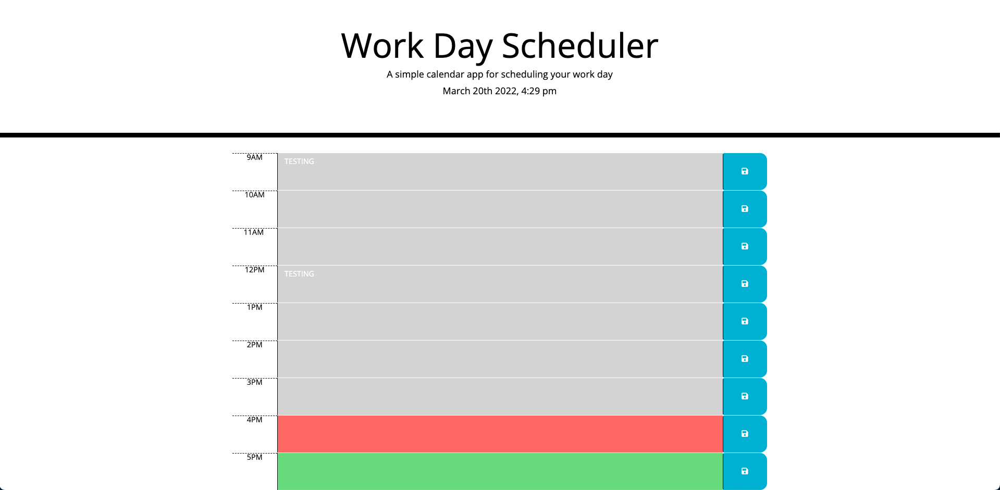

# Work Day Scheduler Starter Code

Description

This challenge is to create a work day scheduler. 
The purpose of this is to use Jquery and Bootstrap to generate a work day scheduler that saves description in the text area.

Screenshot

My Links:

https://rtleib.github.io/work-day-scheduler-challenge-05/

https://github.com/rtleib/work-day-scheduler-challenge-05